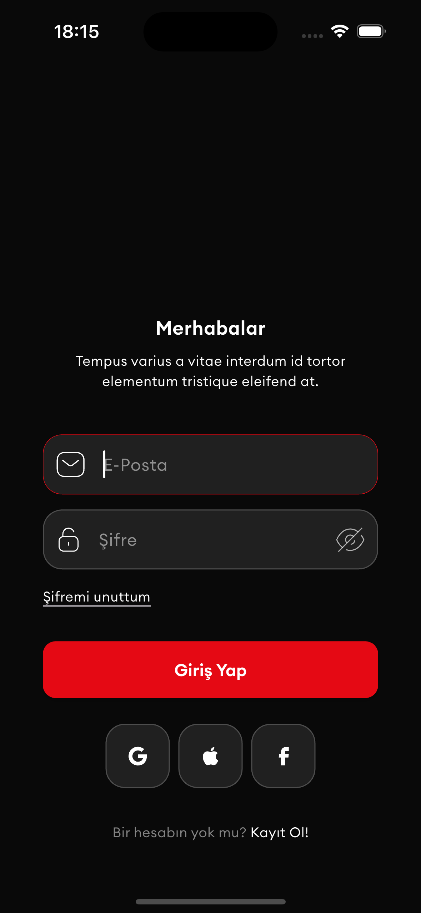
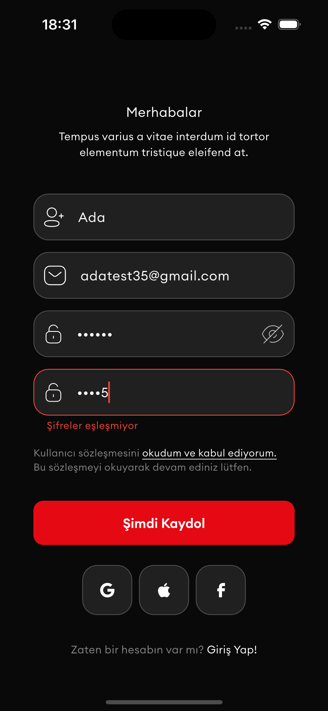
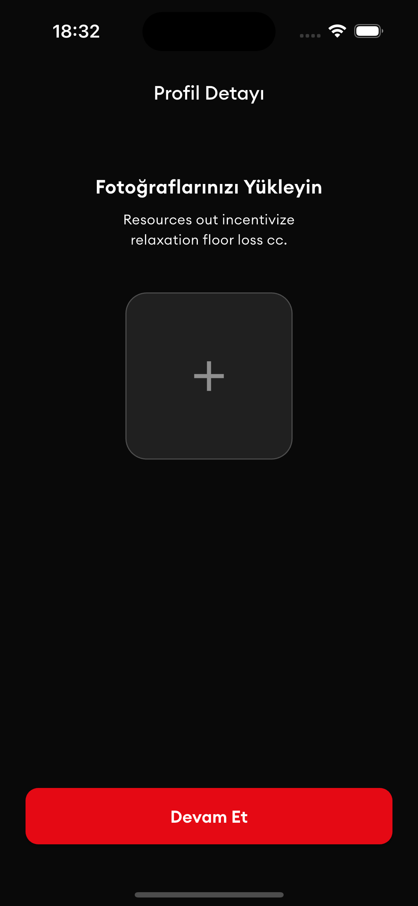
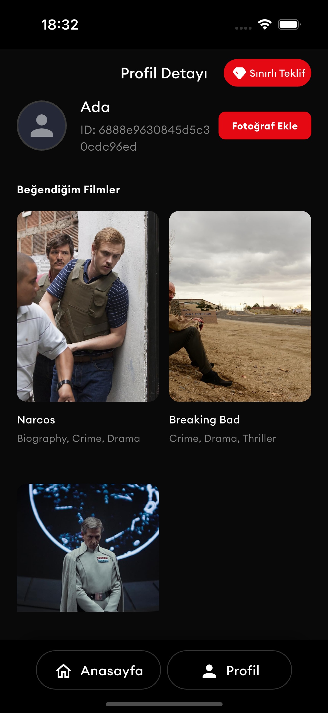
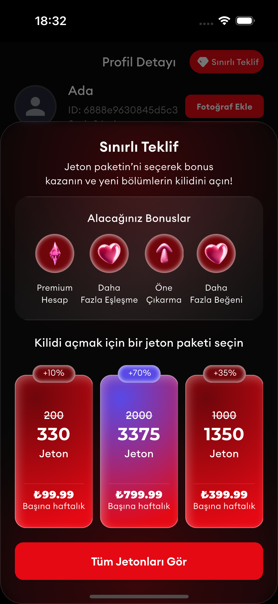

# Movie App Case - Flutter Film Uygulaması

Modern Flutter mimarisi ile geliştirilmiş film keşif ve kullanıcı profil yönetimi uygulaması.

## 📱 Ekranlar

- **Giriş (Login)** - E-posta ve şifre ile kullanıcı girişi
- **Kayıt (Register)** - Yeni kullanıcı hesabı oluşturma
- **Anasayfa (Keşfet)** - Film listesi ve sonsuz kaydırma
- **Profil Sayfası** - Kullanıcı bilgileri ve favori filmler
- **Sınırlı Teklif Bottom Sheet** - Paywall ve jeton satın alma

## 🔐 Kimlik Doğrulama

- JWT token tabanlı güvenli kimlik doğrulama
- Flutter Secure Storage ile token saklama
- Otomatik giriş kontrolü
- Başarılı girişte ana sayfa yönlendirmesi

## 🎬 Ana Sayfa Özellikleri

- Sonsuz kaydırma (Infinite scroll)
- Sayfa başına 5 film gösterimi
- Pull-to-refresh desteği
- Favori film işlemleri
- Otomatik yükleme göstergesi

## 👤 Profil Özellikleri

- Kullanıcı bilgilerini görüntüleme
- Favori filmler listesi
- Profil fotoğrafı yükleme
- Güvenli çıkış işlemi

## 🏗️ Teknik Yapı

**Durum Yönetimi**: BLoC Pattern + GetIt Dependency Injection
**Mimari**: Clean Architecture prensiplerine uygun katmanlı yapı
**Navigasyon**: Bottom Navigation Bar ile sayfa geçişleri
**Depolama**: Flutter Secure Storage

## 🛠️ Kullanılan Teknolojiler

- Flutter BLoC - Durum yönetimi
- GetIt - Bağımlılık enjeksiyonu
- HTTP - API iletişimi
- Flutter Secure Storage - Güvenli depolama
- Responsive Sizer - Responsive tasarım

## 🚀 Kurulum

```bash
flutter pub get
flutter run
```

**Test Bilgileri**: API ile entegre çalışır, gerçek kullanıcı kaydı ve girişi destekler.
<h2>Screenshots</h2>


<p>
  
  
  
</p>
<p>
  
  
  
</p>